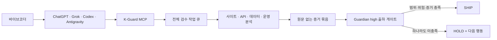

# 2026 오픈소스 개발자대회 결과보고서 작성 초안

작성 상태: product source `72e2aea` evidence RC. tested revision `add8fe38`의 최종 bounded full-regression receipt 완료(3,265 collected / 3,261 passed / 4 skipped / 0 failed / 0 errors). EXTERNAL URLS PENDING · package final pending
기준일: 2026-08-25
공식 안내: <https://www.oss.kr/pages/2>

공식 페이지는 출품작으로 결과보고서, 3분 시연영상, 소스코드를 요구하고 2차에서 기능 테스트와 라이선스 검증을 진행한다고 안내한다. 세부 평가 기준과 결과보고서 양식은 7월 23일 오리엔테이션 자료가 공개되면 이 초안의 항목명을 최종 양식에 맞춰 재배치한다.

## 0. 제출 정보

| 항목 | 작성값 |
|---|---|
| 프로젝트명 | K-Guard MCP, 안경선배 |
| 한 문장 | 바이브코딩 결과물을 사이트·API·데이터·운영 네 영역에서 끝까지 검수하고, 한국 개인정보 맥락과 출하 증거를 fail-closed로 판단하는 로컬 MCP 감사관 |
| 부문 | 자유과제 |
| 분야 | 인공지능, 보안·안전, 개발자 도구 |
| 라이선스 | MIT |
| 실행 환경 | Python 3.11~3.14, MCP 지원 AI 클라이언트 |
| 소스 제공 | 제출 패키지의 전체 Git 저장소와 `SHA256SUMS` |
| 제출자 | 이풍현, 40세, 공무원, 일반부문 |

## 1. 프로젝트 요약

바이브코딩은 앱을 빠르게 만들게 해주지만, 출하 전에 사이트 노출, API 인증 경계, 개인정보 흐름, 운영 설정을 함께 검토할 시니어 인력이 항상 있는 것은 아니다. K-Guard MCP는 개발자가 사용 중인 AI 코딩 도구 안에서 전체 워크스페이스 검수를 접수하고, 검사가 끝나기 전에는 완료 판정을 내리지 않으며, 출하 기준을 충족하지 못하면 HOLD하는 감사관이다.

제품의 북극성은 전지전능한 보증서가 아니다. **한국 바이브코더가 출하 직전 부를 수 있는 시니어 감사관과 fail-closed release gate**다. 설명은 초보자도 행동할 수 있게 짧게 주되, 실제 검사는 배포 산출물과 생략 범위까지 끈질기게 확인한다.

## 2. 해결하려는 문제

1. 빠르게 만든 앱은 기능이 동작해도 인증 누락, API key 노출, 과도한 데이터 수집, 운영 설정 누락이 함께 남기 쉽다.
2. 기존 정적 분석기는 개별 규칙 결과를 잘 내지만, 바이브코더에게 무엇을 먼저 고치고 출하를 멈춰야 하는지 하나의 흐름으로 전달하지 못하는 경우가 있다.
3. 한국 서비스는 주민등록번호, 휴대전화번호, 계좌·카드 정보, 고유식별정보, 보유기간·파기, 국외 이전 등 지역 맥락을 함께 검토해야 한다.
4. finding이 0개라는 사실과 검사 범위가 완전하다는 사실은 다르다. 읽지 못한 파일이나 생략된 검증이 있으면 통과시키지 않는 계약이 필요하다.

## 3. 목표 사용자와 경험

주 사용자는 전문 보안팀 없이 GPT, Grok, Codex, Antigravity로 웹앱과 API를 만드는 개인·소규모 팀이다.

사용 흐름은 다음과 같다.

1. `k-guard install --client auto --profile local-dev --workspace .`로 현재 프로젝트와 AI 클라이언트를 함께 결속한다.
2. 대화에서 `check_my_app`으로 전체 검수를 접수한다.
3. `continue_review`로 완료될 때까지 이어서 확인한다.
4. 첫 번째 blocking finding부터 수정한 뒤 `check_my_app`을 다시 완료한다.
5. 최신 소스 영수증의 `review_id`를 `start_review_before_ship`에 전달해 canonical Guardian high 출하 검수를 실행한다.
6. 미완료 범위나 외부 qualification 증거가 남으면 SHIP 대신 HOLD한다.

## 4. 시스템 구조

대표 사용자 도구는 `check_my_app`, `continue_review`, `start_review_before_ship`이다. 내부 엔진과 보조 분석 도구는 유지하되, 최종 출하 권한은 Guardian high 한 곳으로 통일한다.

## 5. 검수 범위

| 영역 | 확인 내용 | 대표 위험 |
|---|---|---|
| 사이트 | 배포 산출물, 보안 헤더, 공개 노출, 제한된 동적 probe | 디버그 노출, 민감 응답, 잘못된 캐시·헤더 |
| API | route, auth boundary, IDOR, 서버·클라이언트 신뢰 경계 | 인증·인가 누락, 관리자 API 노출, 사용자 간 데이터 접근 |
| 데이터 | 개인정보 필드, 데이터 흐름, SQL AST, RBAC·RLS, 보유·파기 | 과수집, 암호화·파기 누락, 과도한 DB 권한 |
| 운영 | 환경 설정, dependency, MCP policy, CI, suppression, evidence | secret 노출, 취약 의존성, 임의 예외, 불완전한 출하 증거 |

Python, JavaScript, TypeScript, Java, Kotlin, Go, PHP, Ruby, C#의 개발 검증팩을 제공한다. 모든 언어에서 완전한 inter-procedural 의미 이해를 주장하지 않으며, 지원 범위 밖은 명시적으로 구분한다.

## 6. 한국 개인정보 특화

K-Guard는 한국 서비스에서 자주 쓰이는 개인정보 필드와 거버넌스 신호를 별도 규칙으로 다룬다.

- 주민등록번호, 외국인등록번호, 운전면허번호, 여권번호 등 고유식별정보 후보
- 휴대전화번호, 이메일, 주소, 계좌·카드 정보 등 연락·금융 정보
- 수집 목적, 동의, 보유기간, 파기, 위탁, 국외 이전 관련 구현 신호
- 개인정보 처리 흐름과 저장소·로그·응답 경계
- 원문 대신 keyed fingerprint, detector subtype, body/header 위치, response hash를 남기는 증거 정책

이 기능은 법률 자문이나 적법성 보증이 아니다. 코드와 설정에서 확인 가능한 구현 신호를 출하 전 검토 항목으로 끌어올리는 개발자 도구다.

## 7. fail-closed 설계

- `check_my_app`은 빠른 통과 도구가 아니라 전체 워크스페이스 감사를 작업으로 접수한다.
- 설치한 workspace 밖의 경로는 검사를 시작하기 전에 high HOLD로 거부한다.
- 완료한 1차 검수의 소스 스냅샷이 바뀌면 이전 `review_id`로 출하 검수를 시작할 수 없다.
- 리뷰가 terminal 상태가 되기 전에는 출하 판단을 내리지 않는다.
- 읽지 못한 후보, 파일 수·크기 한도 초과, symlink·junction, 검사 중 source drift를 high 범위 finding으로 올린다.
- 사이트, API, 데이터, 운영 중 하나라도 실행되지 않으면 finding 0개여도 SHIP하지 않는다.
- control error도 Guardian-shaped HOLD 응답으로 반환한다.
- suppression은 만료, 소유자, 이유, scope hash가 결속된 정책으로만 인정한다.

## 8. 검증 방법과 현재 결과

합성·개발·공개 benchmark·실제 field 증거를 섞지 않고 등급을 분리한다.

| 검증 | 현재 결과 | 주장 가능 범위 |
|---|---|---|
| 전체 회귀 테스트 | tested revision `add8fe38`, product source `72e2aea`: 3,265 collected / 3,261 passed / 4 skipped / 0 failed / 0 errors, 1,740.40초 | Windows normal-user 한 장비의 bounded product regression으로만 사용; detector accuracy가 아님. 명시적 skip 4개를 실행했다고 주장하지 않음 |
| coverage | 최종 full-regression receipt는 테스트 결과를 결속하며 별도 coverage 수치를 주장하지 않음 | coverage 숫자를 테스트 통과 수와 혼동하지 않음 |
| 한국 fixture | 117건: positive TP 70/FN 0, clean-negative FP 0/TN 27, targeted-absence 20건 별도, workspace contract 5건 별도 | 평가자 작성 개발 fixture의 규칙 회귀 |
| 한국 민감정보·조직번호 holdout | 68건, TP 43/FN 0/FP 0/TN 25, exact two-run repeat | fixture와 합쳐 185회 separate-lane execution으로만 표기. 평가자 작성·구현 후 합성 점검이며 pooled unique count·combined confusion matrix를 주장하지 않음. blind/field accuracy·실시간 등록 검증 아님 |
| 합성 한국 코퍼스 | positive 500, negative 100, recall 1.0, FPR 0.0 | 합성 규칙 회귀 |
| 내부 제품 게이트 | 500 local loopback target, exact pass rate 1.0 | 로컬 제품 계약 |
| 공개 scorecard 무결성 | 전체 FAIL: 역사적 OWASP BenchmarkPython artifact digest·size mismatch, Juliet post-tuning replay first-result binding mismatch | 무결성 PASS lane만 개별적으로 인용하고 전역 TP/FP/FN이나 종합 정확도로 합산하지 않음 |
| OWASP BenchmarkJava CWE-89 최초 | 504 case, TP 51/FN 221/FP 33/TN 199, recall 0.187500, precision 0.607143, specificity 0.857759, verdict HOLD | evidence integrity PASS인 공개 사전등록 component 최초 결과. 낮은 recall을 그대로 보존 |
| OWASP BenchmarkPython 역사 결과 | 기록 수치는 있으나 evidence integrity FAIL | 현재 제출 정확도 근거로 사용 금지 |
| seeded mutation | TP 25, TN 25 | 단일 패턴 회귀, 실전 정확도 주장 금지 |
| 실제 AI 클라이언트 | Codex, Grok, Antigravity 3종의 현재 v6 process-level 검증 | fresh-wheel receipt를 통해 product source `72e2aea`, package tree, wheel에 결속한 self-attested sanitized replay. vendor UI 인증 아님; Grok만 별도 local-transcript receipt로 6개 K-Guard rawOutput 호출을 검증했고 tools list는 별도 기록 |
| 과거 공개 앱 AI 판정 | revision 9488898, 24회 exact repeat, high/critical 후보 31건, 동일 모델 계열 fresh reviewer 3명이 모두 TP로 판정 | 역사적 개발 증거. 사람 수동 판정이 아님. 현재 라벨로 전용하지 않음 |
| 현재 코드 공개 앱 재현 | 12개 앱 × 2회 exact repeat, 자동 release-blocking 후보 14건, 취약 probe 11 / 11·benign fixture 1 / 1 탐지 | 현재 analyzer 재현성과 선택 source-oracle 탐지. full-app recall 아님 |
| fresh-wheel 실제 MCP | 28개 tool, 실제 stdio 5회 호출, 초기·출하 review 종결, source snapshot 결박, invalid ID fail-closed | 설치 wheel의 대표 protocol workflow. UI 인증·SHIP 판정 아님 |
| NIST Juliet Java CWE-89 첫 결과 | 420 unit, TP 180/FN 30/FP 0/TN 210, recall 0.857143, precision 1.000000, specificity 1.000000, exact repeat | evidence integrity PASS인 사전등록 공개 단일 경계 최초 결과 |
| NIST Juliet 수정 후 재생 | 기록상 같은 420 unit, TP 210/FN 0/FP 0/TN 210 | first-result digest binding 불일치로 integrity FAIL. 새 독립 holdout이 아님. 제출 정확도 근거로 사용 금지 |
| 9개 언어 개발팩 | 90 case 2회 exact repeat | 개발 검증팩 재현성 |
| 단일 장비 합성 성능 | product source `72e2aea`: cold scan p50/p95 1.422/1.502초, end-to-end p95 1.850초; warm p50/p95 1.401/1.413초; 10/50/100 MiB p50 13.980/70.279/140.724초, 0.715/0.711/0.711 MiB/s; 100 MiB peak RSS 155,209,728 bytes | Windows/CPython 3.11.9 한 대의 synthetic all-benign low-signal scanner capacity |
| thread·process 동시성 | thread 1/4/8 aggregate 0.713/0.697/0.691 MiB/s, speedup 1.000/0.978/0.969. 별도 fresh-child process 1/2/4 speedup 1.000/1.968/3.672, efficiency 1.000/0.984/0.918 | exact 64 KiB benign single-host. thread 병렬 이득은 주장하지 않으며 process lane도 운영 SLO·field accuracy·finding-dense·hardware-normalized·타 제품 비교가 아님 |
| 결과 지문 경계 | 모든 성능 corpus가 finding 0건이라 stable empty-result digest의 식별력이 제한됨 | finding-bearing 출력의 누락·변형 또는 결과 불변성을 증명하지 않음 |
| 실제 owned/partner 앱 | field 0/12, 진행 중 | 인간 시니어급 실전 정확도 주장 금지 |

현재 코드의 공개 앱 재현과 fresh-wheel stdio는 자동 검증했다. 클라이언트 3종 녹화와 과거 후보 31건 AI 판정은 과거 revision에 묶인 process/development 증거다. 현재 자동 release-blocking 후보 14건에 그 라벨을 전용하지 않으며, 11 / 11 targeted probe도 전체 앱 recall이 아니다. 공개 scorecard 전체는 두 역사 lane의 결박 실패로 FAIL이므로 BenchmarkJava·Juliet 최초-result 등 무결성 PASS lane만 분리해 인용한다. owned/partner field는 0/12이므로 대상 수상 가능성이나 인간 시니어와 동급인 field 정확도는 주장하지 않는다. 현장 실증은 **field evidence pending**이다.

## 9. AI 클라이언트 상호운용 실증

설치 어댑터는 ChatGPT, Grok, Codex, Antigravity에 맞췄다. 호환 완료 판정은 각 클라이언트에서 `install → restart → tool list → check_my_app → reconnect`를 한 번의 기록으로 확인하고 별도 review assertion이 있는 경우에만 부여한다. 현재 assertion은 self-attested이며 외부 심사자 신원이나 독립성을 증명하지 않는다.

촬영과 수집 절차는 [AI 클라이언트 상호운용 실증 키트](client-interop-evidence-kit-ko.md)를 사용한다. 결과표는 [자동 생성 상태](client-interop-status-ko.md)를 그대로 삽입하고, 영상 파일명·SHA-256·source revision을 부록에 기록한다.

현재 문장:

> Codex, Grok, Antigravity의 구조화된 실행 결과를 13초 고대비 sanitized process-log replay로 만들고, 실제 MP4·대표 프레임·decoder 수락 결과를 SHA-256으로 결속했다. v6 record는 fresh-wheel receipt를 통해 product source `72e2aea`, package tree, 설치 wheel에 고정된다. 이는 vendor UI 인증이 아니며, Grok의 6개 K-Guard rawOutput 호출만 별도 local-transcript receipt로 deterministic audit했고 tools list는 별도 기록했다. Codex와 Antigravity 노출 판정은 structured client self-report다.

## 10. 오픈소스와 재현성

- 소스 라이선스: MIT
- dependency closure 라이선스 보고서: unknown 0, review-required 0
- CycloneDX 1.5 SBOM: component 41개
- 고정 build/evidence lock과 두 번의 바이트 동일 reproducible build 검사
- `evidence/SHA256SUMS`로 공개·합성·개발 증거 파일 무결성 확인
- GitHub OIDC/Sigstore provenance와 SBOM attestation을 release workflow에 포함
- `CONTRIBUTING.md`, `CODE_OF_CONDUCT.md`, `SECURITY.md` 제공

## 11. 차별점

1. 개별 finding 나열이 아니라 전체 검수 접수부터 Guardian 출하 판단까지 하나의 MCP 경험으로 연결한다.
2. 한국 개인정보 필드와 보유·파기·국외 이전 구현 신호를 개발자 행동으로 번역한다.
3. 검사 범위 미완료를 조용한 통과가 아닌 고위험 HOLD로 처리한다.
4. 정적 분석, 제한된 동적 검수, dependency, DB 정책, MCP runtime 관찰을 한 증거 계약으로 묶는다.
5. 합성 결과와 field 결과, passive 후보와 authorized deep 검증, 앱 위험 해소와 release qualification을 분리해 과장을 막는다.

## 12. 한계와 다음 단계

- 앱의 비즈니스 의도를 인간 시니어처럼 완전히 이해하지는 않는다.
- JS/TS 분석은 강화됐지만 완전한 inter-procedural 타입·프레임워크 의미 분석은 아니다.
- 과거 revision 9488898 공개 개발 앱의 후보 31건은 여러 manifestation을 포함하며 31개의 독립 취약점을 뜻하지 않는다. 현재 자동 release-blocking 후보 14건과 섞지 않는다.
- reviewer 3명은 동일 모델 계열 AI다. 사람 수동 판정이나 cross-vendor 독립 검증이 아니다.
- NIST Juliet의 수정 후 TP 210/FN 0 기록은 같은 corpus를 재생한 post-tuning 결과이며 first-result digest binding도 불일치한다. Juliet post-tuning replay는 integrity FAIL로 현재 제출 근거에서 제외하며 새 독립 holdout이 아니다.
- 역사적 OWASP BenchmarkPython 기록은 내부 artifact digest·size mismatch로 제출 정확도 근거에서 제외한다.
- 단일 장비 성능은 synthetic all-benign low-signal 입력과 한 CPython 프로세스의 thread 동시성만 측정했다. 운영 SLO, process scaling, 실제 저장소·finding-dense workload, 경쟁 제품 대비 속도를 뜻하지 않는다.
- 실제 owned/partner field는 0/12이며 TP/FP/FN 독립 라벨은 아직 입력 전이다.
- 클라이언트 증거는 [상태표](client-interop-status-ko.md)의 process-level 완료 범위만 인정한다.
- 현재 제출 시연영상은 실제 Windows 콘솔·공식 Python MCP 클라이언트·제품 CLI 실행만으로 구성한 180초 H.264 1920x1080 전체 디코딩 영상이며, 동일한 합성 음색의 VoxCPM2 한국어 나레이션 오디오 스트림 1개와 하단 자막을 포함한다.
- 모든 취약점 탐지, 침해 부재, 법적 적합성을 보증하지 않는다.

다음 우선순위는 실제 앱 12개 이상 field campaign을 사전등록하고, 도구 실행자와 라벨 판정자를 분리해 TP/FP/FN을 확보하는 일이다. 이 증거가 들어오기 전까지 공개 개발 결과를 field 성능으로 승격하지 않는다.

## 13. 3분 시연 구성

| 구간 | 시간 | 화면 |
|---|---:|---|
| 개발 동기·제품 개요 | 0:00~0:26 | 실제 PowerShell에서 개인정보 유출사고를 겪은 동기, 제품 한 문장, 현재 README·revision·소스 구성 |
| MCP 공격 차단 | 0:26~0:47 | 공식 Python MCP 클라이언트의 정상 요청 허용, 비밀값 유출 공격 403 차단, upstream 0회, transaction 영수증 |
| 제품 검수·재검수 | 0:47~2:38 | 실제 제품 콘솔에서 현재 소스, 탐지, Guardian HOLD, 수정 diff, 같은 범위 재검수, 한국 개인정보 분류, focused tests |
| 출시 점검·기대효과 | 2:38~3:00 | 실제 PowerShell에서 핵심 소스 위치, 6개 집중 테스트, 한국 개인정보 qualification, 원문 미노출과 기대효과 확인 |

## 14. 제출 직전 체크리스트

- [ ] 오리엔테이션 결과보고서 양식에 제목과 순서 매핑
- [x] 제출자 정보와 소스 패키지 제공 방식을 입력
- [x] tested revision `add8fe38`, product source `72e2aea` 최종 full-regression receipt 삽입: 3,265 collected / 3,261 passed / 4 skipped / 0 failed / 0 errors
- [x] 실제 클라이언트 3개 이상 서로 다른 녹화와 SHA-256 증거 레코드 생성
- [x] 클라이언트 영상 파일을 `submission/client-interop/`에 게시
- [x] 공개 개발 앱 실효성 게이트의 고정 기준 통과. 동일 모델 계열·비인간 판정 경계 유지
- [x] 실제 owned/partner 앱 12개 이상 독립 라벨 또는 미완료 한계 명시
- [x] 3분 영상 길이와 장면별 자막 확인
- [x] 이미지·폰트·음악·샘플 데이터 재배포 권리 확인
- [ ] `python scripts/contest_readiness.py --require-award-evidence` 최종 실행

## 부록 A. 근거 파일

| 보고서 내용 | 저장소 근거 |
|---|---|
| 북극성·사용자 경험 | `docs/product-north-star-ko.md` |
| 설치·클라이언트 연결 | `docs/quickstart-ko.md`, `docs/mcp-client-install.md` |
| 상호운용 녹화 | `docs/client-interop-evidence-kit-ko.md`, `evidence/clients/` |
| 현재 코드 공개 앱 재현 | `evidence/public/current-source-replay-v1/` |
| 한국 AI-only 검증 | `evidence/qualification/korean-privacy-ai-only-v1.json` |
| 공개 정답셋 scorecard | `evidence/qualification/ai-public-benchmark-scorecard-v1.json` |
| 단일 장비 합성 성능 | `benchmark-report.json` |
| 과거 AI 판정 개발 증거 | `evidence/public/development-apps-12-v3/`, `scripts/public_app_effectiveness_v2.py` |
| NIST Juliet 첫 결과·수정 후 재생 | `evidence/public/holdout/juliet-java-cwe89-first-result.json`, `evidence/public/holdout/juliet-java-cwe89-remediation-replay.json` |
| 검증 스냅샷 | `docs/contest-2026-submission-ko.md`, `contest-readiness-report.json` |
| field 방법론 | `docs/field-benchmark-methodology-ko.md`, `docs/field-campaign-kit-ko.md` |
| 한국 개인정보 | `docs/pipc-reference-mapping.md` |
| 라이선스·SBOM | `license-report.json`, `sbom.cdx.json`, `THIRD_PARTY_NOTICES.md` |
| 위협 모델 | `docs/threat-model.md` |

## 부록 B. 보고서용 결론

K-Guard MCP는 바이브코더의 속도를 늦추는 검사기가 아니라, 그 속도로 만든 결과물을 책임 있게 출하하도록 옆에서 끝까지 봐주는 안경선배를 목표로 한다. product source `72e2aea`는 한국 fixture·holdout 185회 separate-lane 평가, current-source 공개 앱 12개×2회 재현, BenchmarkJava·Juliet 최초-result, fresh-wheel MCP, 현재 v6 client 3종 sanitized replay와 단일 장비 합성 성능 근거를 갖췄다. tested revision `add8fe38`의 최종 bounded full-regression receipt는 3,265 collected / 3,261 passed / 4 skipped / 0 failed / 0 errors를 기록했다. 이는 Windows 일반 사용자 한 장비의 제품 회귀이며 detector accuracy가 아니고 명시적 skip 4개를 실행했다고 주장하지 않는다. BenchmarkJava 성능은 HOLD이고 역사적 OWASP Python·Juliet replay는 integrity FAIL로 현재 근거에서 제외한다. 사람·cross-vendor 판정과 owned/partner field 0/12도 비어 있으므로 인간 시니어와 동급인 field 정확도나 대상 수상을 주장하지 않는다. 공식 GitHub·YouTube는 EXTERNAL URLS PENDING이고 package final pending이다.
