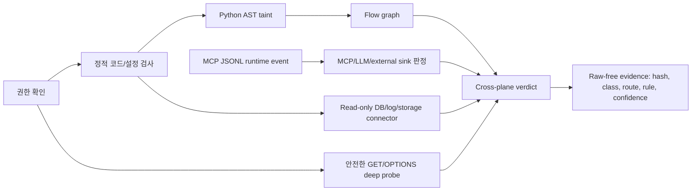

# K-Guard Inner-Core Product Gate

이 문서는 K-Guard가 "표층 페이지 확인"을 넘어 코드, 설정, 런타임, MCP 이벤트, 저장소, 데이터 흐름 그래프까지 결합해 감사하는지를 검증하는 로컬 합성 게이트를 설명합니다.

중요한 경계:

- 이 게이트는 실제 외부 사이트 500개 취약점 탐지가 아닙니다.
- 500은 로컬 loopback deep-probe 시나리오를 500회 반복한 제품 검증 숫자입니다.
- 외부 도메인에 대한 상용 성능 주장은 별도 소유/파트너/허가 대상 canary 검증으로 분리해야 합니다.
- 결과에는 원문 개인정보, secret, 세션 값이 저장되지 않습니다.

## 실행

```powershell
python scripts\inner_core_product_gate.py --targets 500 --output tmp\inner-core-product-gate-500.json --markdown tmp\inner-core-product-gate-500.md --html tmp\inner-core-product-gate-500.html
```

## 현재 통과 기준

| Plane | 의미 | 통과 조건 |
|---|---|---|
| authorization | 권한 없는 외부 동적 검사를 차단하는지 | 외부 unauthenticated target은 네트워크 전 단계에서 block |
| dynamic_deep_probe | 고정 경로 GET/OPTIONS 심화 검사가 정확한지 | 기대 규칙 누락 0, 예상 외 규칙 0 |
| false_positive_controls | 오탐 억제 게이트가 있는지 | injected missing/unexpected negative control 통과 |
| static_config_pii_mcp | 코드/설정/개인정보/MCP 문구를 잡는지 | 한국형 PII, secret, MCP poisoning, retention, connector 규칙 출현 |
| python_ast_taint | Python AST taint가 source-to-sink를 연결하는지 | request-derived data가 log/external HTTP/LLM/response sink로 연결됨 |
| runtime_mcp_observer | MCP runtime event를 보는지 | tool result PII/hidden instruction이 LLM/MCP sink로 연결됨 |
| read_only_connectors | DB/log/storage를 read-only로 보는지 | SQLite/log/storage PII at-rest 규칙 출현 |
| raw_free_evidence_graph | 원문 없이 그래프가 생성되는지 | flow node/edge 존재, 금지 raw marker 0 |
| cross_plane_verdict | 개인정보와 sink를 결합 판정하는지 | Korean PII to agentic/external sink cross-plane 규칙 출현 |

추가 raw-free 조건:

- synthetic fixture 원문 marker가 보고서에 남지 않아야 합니다.
- 보고서 직렬화 결과를 다시 PII/secret detector로 self-scan했을 때 blocking PII/secret rule이 없어야 합니다.
- timestamp, loopback IP처럼 보고서 메타데이터로 볼 수 있는 약한 항목은 raw 개인정보 유출 blocker로 보지 않습니다.

## 500회 기준 최근 결과

- passed: true
- deep probe targets: 500
- scenario count: 24
- expected dynamic rules: 481
- observed dynamic rules: 481
- missing expected rules: 0
- unexpected rules: 0
- recall: 1.0
- exact target pass rate: 1.0
- raw-free report: true
- raw-free detector self-scan: true

## 이게 말해주는 것

K-Guard는 단순히 `/admin`이 200인지 보는 도구가 아닙니다. 아래 흐름을 한 제품 게이트에서 확인합니다.



## 아직 과장하면 안 되는 부분

- 이 게이트만으로 "현실 웹 전체에서 개인정보 유출 탐지율 100%"라고 말하면 안 됩니다.
- 로그인 후 화면, mutation API, 권한 우회, password guessing, exploit payload는 이 게이트 범위가 아닙니다.
- 실제 제출용 성능 수치는 소유/파트너/허가된 canary 앱과 수동 판정표를 따로 만들어야 합니다.

## 상용 제출용 문구

K-Guard는 로컬 우선 MCP 보안 감사 도구입니다. 원문 개인정보를 저장하지 않고, 정적 코드/설정 검사, Python AST taint, 안전한 GET/OPTIONS 동적 검증, MCP runtime event 관찰, read-only connector, raw-free evidence graph를 결합해 한국형 개인정보가 로그, 응답, 외부 HTTP, LLM, MCP tool 경계로 이동할 가능성을 설명합니다.
